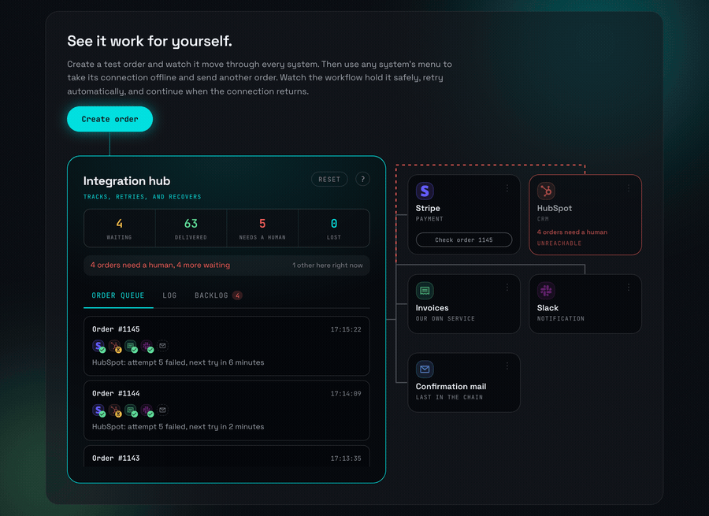

# Nothing Gets Lost



[](https://github.com/danielsolves/nothing-gets-lost/actions/workflows/ci.yml)

When two systems talk to each other, things go missing. A payment arrives but the
customer never appears in the CRM. A form is submitted but no invoice is written.
Nobody notices until somebody asks three weeks later.

**This is a live lab for that problem. Break it on purpose and watch nothing get lost.**

→ **[Try it](https://ngl.danielsolves.ai)** · send an order, open the menu on any system and break it, watch it come back.

## What you can check yourself

You do not have to take my word for any of it:

| | |
|---|---|
| **Stripe receipt** | a page served by stripe.com, not by this demo |
| **Confirmation mail** | lands in your inbox; the `Received` header is stamped by your provider |
| **The proof chain** | the gap between those two timestamps is the outage you caused |
| **SQL console** | query the database yourself, read-only |
| **Your own endpoint** | give it a url and see the retries arrive on your server |
| **Your own Slack** | connect a workspace and the notification appears in the channel you pick |
| **Your own HubSpot** | connect a portal and the contact appears in your CRM, with HubSpot's own `createdate` |

Connecting is optional and lasts 24 hours. Slack is asked for `chat:write` and
`incoming-webhook`, HubSpot for `crm.objects.contacts.read` and `.write`, and nothing
else. There is a **Disconnect** button, and the token is deleted rather than merely
ignored.

The read-back against **my** HubSpot portal is an indication, not proof. I render that
answer, so you would be right not to trust it. It is labelled as such in the interface.
Everything in the table above is not.

## Run it

```bash
git clone https://github.com/danielsolves/nothing-gets-lost
cd nothing-gets-lost
cp .env.example .env
docker compose up
```

Open http://localhost:5173. **No API keys required.** Without a model key the reading
step replays recorded answers and says so on screen; without Stripe, HubSpot, Slack or
SMTP credentials those targets simply fail and retry, which is a legitimate thing to
watch. Fill in `.env` when you want the real ones.

## How the failures work

Every system in the diagram carries the control that breaks it: three dots in the
corner of its tile, and under them the four states it can be put into. It really does
break things:

| Menu entry | What actually happens |
|---|---|
| Reachable | the call goes through |
| Slow | the gate holds the request for 8s; the caller times out at 5s |
| Failing | a real 503 |
| Unreachable | the socket is destroyed, so the caller sees a real `ECONNRESET` |

The last two look alike and mean opposite things, which is why the menu spells both
out. **Failing** is a system that is down. **Unreachable** is a system that is running
perfectly well behind a line that is not: HubSpot, Stripe and Slack keep going, **we
simply stop being able to reach them**, and that is the most common real outage, far
more common than a provider going down. The invoice service is the exception: it
closes its listening socket, so there "off" is literal, and its menu says so in its
own words.

The same menus carry the one-off mischief: the repeated payment sits on Stripe, where
a duplicate webhook would come from, and the two malformed orders sit on the order
mail they would arrive as.

The mediator does not know any of this happened. It sees a failed HTTP call and does
what it would do in production.

## The numbers on the box

`10,000 events · 0 lost · 0 duplicated`, produced by
[`test/load/soak.test.ts`](test/load/soak.test.ts). The result is written to
[docs/load-test-result.txt](docs/load-test-result.txt) by the run itself, and CI
regenerates it as its own job.

The nine scenarios from the specification are in
[`test/integration/pipeline.test.ts`](test/integration/pipeline.test.ts): a repeated
webhook, a cut target, a returning target, six failures reaching the dead letter box, a
worker dying between the call and the record, two workers racing for the same row, the
confirmation mail waiting for the chain, reviving a dead letter, and `lost` staying at
zero through arbitrary chaos.

## Honest caveats

- **The retry schedule is compressed.** 2s, 8s, 30s, 2min, 10min. In production I would
  start at 30s and stretch over hours. The first delays have to be visible inside a
  visitor's attention span.
- **Your email address is optional, and the specification says it should not be.**
  Section 9.7 makes it mandatory and calls it the strongest proof, which it is. It is
  optional here anyway, because somebody should be able to watch a real order run all
  the way through before handing anything over: the order the big button sends asks
  you for nothing. What you give up by leaving the address out is the confirmation
  mail, and with it the second witness of the proof chain, a timestamp stamped by your
  own provider rather than by me. The chain then rests on one foreign witness, the
  Stripe receipt, instead of two. Give an address and you get both.
- **There is one world, not one per visitor.** If somebody else is experimenting you
  will see their traffic, and the page says so. Per-visitor sandboxes would mean the
  switches were not really switching anything.
- **Slack deduplication is weaker than the rest.** In my workspace it reads the channel
  back before posting, which leaves a narrow race. For a notification that is the right
  trade; for the invoice it would not be, which is why that one uses a database
  constraint. In your workspace it cannot read at all, which is the next point.
- **In your Slack, an interrupted send is parked rather than repeated.** Connecting
  asks for `chat:write` and `incoming-webhook`, and for nothing that reads your
  messages. So if this demo dies in the moment between calling Slack and recording the
  result, nobody can establish whether the message arrived. Rather than push a possible
  duplicate into your workspace, that delivery goes to **needs a human** with the
  reason written out. `lost` still reads 0, because parked is not lost.
- **The queue is hand-built on purpose**, and that is not general advice. See
  [why no queue library](docs/why-no-queue-library.md).

More: [how it works](docs/how-it-works.md) ·
[why no queue library](docs/why-no-queue-library.md) ·
[what I deliberately did not build](docs/what-we-deliberately-did-not-build.md)

## Licence

MIT
